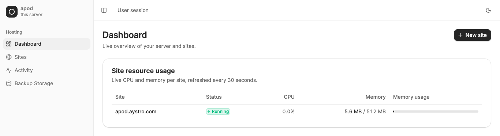

<div align="center">


# apod

A single binary that turns any VPS into a hosting platform. Deploy sites, manage domains, handle SSL — all through Docker containers without the overhead of traditional panels.

</div>

## Why apod?

Hosting panels are bloated. PaaS platforms are expensive. Kubernetes is overkill for most workloads. apod sits in the sweet spot: one binary, zero dependencies beyond Docker, full isolation per site.

- **One binary** — drop it on a server and go
- **Docker-native** — every site runs in its own isolated container stack
- **Automatic SSL** — Let's Encrypt via Traefik, zero config
- **Driver system** — define stacks as YAML (PHP, Laravel, WordPress, Node.js, Odoo, or roll your own)
- **Git deploys** — push to deploy with rollback support and automatic pre-deploy backup
- **Backups** — databases (gzip-compressed) + site files + volume data, scheduled to S3/R2/SFTP/local
- **CLI + REST API** — script everything, automate anything
- **Multi-user** — Linux-level isolation with API key auth and ownership enforcement
- **Resource limits** — CPU, RAM, disk quotas, PID limits — all kernel-enforced
- **Network isolation** — each site gets its own Docker network, can't reach other sites
- **Billing integration** — WHMCS and Paymenter modules for automated provisioning
- **Migration** — export/import sites between servers with a single command
- **SaaS-ify anything** — turn any Docker app into a managed service in minutes
- **Web terminal** — secure token-based container shell access via billing panel

## Web UI

A full web admin panel ships as a driver — manage sites, deploys, domains, backups, users, and 2FA from the browser. Install it on its own domain in one command:

```bash
apod create panel.example.com --driver apod-ui
```

<div align="center">
  
</div>

The panel is served by Traefik with automatic SSL and talks to the daemon over its local socket — same-origin, no CORS, nothing extra to configure. Source: [aystro-com/apod-ui](https://github.com/aystro-com/apod-ui).

## Requirements

- Linux server (Ubuntu 22.04+ recommended)
- Docker Engine 24.0+
- UFW firewall (recommended)
- Go 1.22+ (for building from source)
- Root access
- Ports 80 and 443 available
- `quota` package (for disk quota enforcement)

### Install Dependencies

```bash
# Install Docker
curl -fsSL https://get.docker.com | sh
systemctl enable docker && systemctl start docker

# Install UFW (firewall)
apt install -y ufw
ufw allow 22/tcp    # SSH
ufw allow 80/tcp    # HTTP
ufw allow 443/tcp   # HTTPS
ufw allow 8443/tcp  # apod API (if using remote access)
ufw --force enable

# Install quota tools (for disk limits)
apt install -y quota
```

## Quick Start

```bash
# Install + guided setup (SSL email, system service, drivers, optional web UI)
curl -fsSL https://raw.githubusercontent.com/aystro-com/apod/master/install.sh | sh
# (the installer runs `apod init` for you; run it again any time to re-configure)

# Create a PHP site with resource limits
apod create mysite.com --driver php --ram 512M --cpu 1 --storage 5G

# Deploy a Laravel app from git in one command
apod create myapp.com --driver laravel --repo https://github.com/you/app.git --branch main

# Deploy an Odoo ERP instance
apod create erp.mycompany.com --driver odoo --ram 2G --cpu 2 --storage 20G

# Shell into a site's container
apod access mysite.com

# Check status and resource usage
apod list
apod status mysite.com
apod top

# Create a user for multi-tenant hosting
apod user create client1 --role user
# → Returns an API key for remote management

# Update apod + drivers (auto-restarts)
apod update
```

## Table of Contents

- [Installation](#installation)
- [Configuration](#configuration)
- [Drivers](#drivers)
- [CLI Reference](#cli-reference)
- [REST API Reference](#rest-api-reference)
- [Billing Integrations](#billing-integrations)
- [Security Model](#security-model)
- [Architecture](#architecture)
- [Contributing](#contributing)

---

## Installation

### Requirements

- Linux server (Ubuntu 22.04+ recommended)
- Docker Engine 24.0+
- UFW firewall (recommended)
- Go 1.22+ (for building from source)
- Root access
- Ports 80 and 443 available
- `quota` package (for disk quota enforcement)

### Install Dependencies

```bash
# Install Docker
curl -fsSL https://get.docker.com | sh
systemctl enable docker && systemctl start docker

# Install UFW (firewall)
apt install -y ufw
ufw allow 22/tcp    # SSH
ufw allow 80/tcp    # HTTP
ufw allow 443/tcp   # HTTPS
ufw allow 8443/tcp  # apod API (if using remote access)
ufw --force enable

# Install quota tools (for disk limits)
apt install -y quota
```

### Quick Install

```bash
curl -fsSL https://raw.githubusercontent.com/aystro-com/apod/master/install.sh | sh
mkdir -p /etc/apod/drivers
apod update drivers
```

### From Source

```bash
git clone https://github.com/aystro-com/apod.git
cd apod
CGO_ENABLED=1 go build -o /usr/local/bin/apod ./cmd/apod/
mkdir -p /etc/apod/drivers
cp drivers/*.yaml /etc/apod/drivers/
```

### SystemD Service

Create `/etc/systemd/system/apod.service`:

```ini
[Unit]
Description=apod server orchestrator
After=docker.service
Requires=docker.service

[Service]
Type=simple
ExecStart=/usr/local/bin/apod server --acme-email you@example.com
Restart=always
RestartSec=5

[Install]
WantedBy=multi-user.target
```

```bash
systemctl daemon-reload
systemctl enable apod
systemctl start apod
```

### Updating

```bash
apod update              # Update binary + drivers + auto-restart daemon
apod update drivers      # Update built-in drivers only
apod version             # Check current version
```

---

## Configuration

### Daemon Flags

| Flag | Default | Description |
|------|---------|-------------|
| `--acme-email` | | Email for Let's Encrypt certificates (required for `auto`/`dns`) |
| `--tls-mode` | `auto` | Certificate strategy: `auto` (HTTP-01), `dns` (DNS-01), `external` (proxy-terminated) |
| `--acme-dns-provider` | | lego DNS provider for `--tls-mode=dns` (e.g. `cloudflare`) |
| `--listen` | Unix socket | TCP address for remote API access (e.g., `0.0.0.0:8443`) |
| `--db` | `/etc/apod/apod.db` | SQLite database path |
| `--data-dir` | `/var/lib/apod` | Site data directory |
| `--driver-dir` | `/etc/apod/drivers` | Driver YAML directory |

### TLS / SSL

apod issues and renews certificates through Traefik. Because servers sit behind
very different network setups, the strategy is selectable — `apod init` asks, or
set `--tls-mode`:

| Mode | How certs are obtained | Use when |
|------|------------------------|----------|
| `auto` (default) | Let's Encrypt **HTTP-01** | The domain resolves straight to this server on port 80 (direct DNS, or Cloudflare **DNS-only** / grey-cloud). |
| `dns` | Let's Encrypt **DNS-01** via your DNS provider's API | Behind Cloudflare's proxy (orange-cloud), a CDN, or a load balancer — or you need wildcards. Needs no inbound port 80. |
| `external` | None — your proxy terminates TLS | An upstream (e.g. Cloudflare SSL mode **Full**) handles public HTTPS. apod serves its self-signed default cert, or a cert you drop into `/etc/apod/traefik/dynamic/` (e.g. a Cloudflare **Origin Certificate** for Full (strict)). |

**DNS-01 credentials.** Put your provider's API credentials in the apod service
environment — `apod init` writes them to `/etc/apod/apod.env` (loaded via the
unit's `EnvironmentFile`). For Cloudflare, use a token with `Zone:DNS:Edit`:

```bash
# /etc/apod/apod.env
CF_DNS_API_TOKEN=your-scoped-token
```

```bash
apod server --tls-mode dns --acme-dns-provider cloudflare --acme-email you@example.com
```

apod forwards common provider env vars (Cloudflare, Route 53, DigitalOcean, Azure,
Google Cloud, Hetzner, Linode, OVH, Vultr, Namecheap, Gandi, …) into Traefik; see
Traefik's lego provider list for the exact variable names.

### Data Layout

```
/etc/apod/
  apod.db                 # All state (sites, configs, schedules, logs)
  drivers/
    static.yaml
    wordpress.yaml
    laravel.yaml

/var/lib/apod/                        # Admin-owned sites
  sites/
    example.com/
      files/                          # Site code (mounted into container)
      data/
        mysql/                        # Database files
  backups/                            # Admin site backups
    example.com/
      example.com_20260420_120000.zip

/home/<user>/                         # User-owned sites
  sites/
    mysite.com/
      files/
      data/
  backups/                            # User backups (counts against disk quota)
    mysite.com/
      mysite.com_20260420_120000.zip
```

### Remote Access

```bash
# Start daemon with TCP listener
apod server --listen 0.0.0.0:8443 --acme-email you@example.com

# Connect from another machine
apod --remote https://your-server:8443 --key <api-key> list
```

---

## Drivers

Drivers are YAML files that define application stacks. Each driver specifies Docker images, volumes, ports, environment, deploy hooks, health checks, backup targets, and setup steps.

### Built-in Drivers

| Driver | Stack | Image |
|--------|-------|-------|
| `static` | Nginx | `nginx:alpine` |
| `php` | PHP + Nginx + MySQL (blank, no git) | `webdevops/php-nginx-dev:8.4` + `mysql:8.0` |
| `wordpress` | WordPress + Apache + MySQL | `wordpress:php8.3-apache` + `mysql:8.0` |
| `laravel` | PHP 8.4 + Nginx + MySQL | `webdevops/php-nginx-dev:8.4` + `mysql:8.0` |
| `node` | Node.js + PostgreSQL | `node:22-alpine` + `postgres:16-alpine` |
| `odoo` | Odoo ERP + PostgreSQL | `odoo:17.0` + `postgres:16-alpine` |
| `unifi` | UniFi Network Controller + MongoDB | `jacobalberty/unifi:latest` + `mongo:4.4` |
| `paymenter` | Paymenter billing + MySQL + Redis | `webdevops/php-nginx-dev:8.3` + `mysql:8.0` + `redis:7` |
| `whmcs` | WHMCS + MySQL + ionCube | `php:8.2-apache` + `mysql:8.0` |
| `supabase` | Supabase (Auth, REST, Realtime, Storage, Studio) | `supabase/postgres` + `kong` + 7 services |

**SaaS-ify any app:** Write a 20-40 line YAML driver for any Docker app, connect a billing panel, and sell managed instances. We went from zero to selling managed Odoo in under 30 minutes.

### Writing a Custom Driver

Create a YAML file in `/etc/apod/drivers/`. Example for a Node.js app:

```yaml
name: nodejs
version: "1.0"
description: Node.js application with MongoDB

parameters:
  node_version:
    type: string
    default: "22"
    options: ["18", "20", "22"]

services:
  app:
    image: "node:${node_version}-alpine"
    volumes:
      - "${site_root}:/app"
    ports:
      - "3000"
    environment:
      NODE_ENV: "production"
      MONGO_URL: "mongodb://apod-${site_domain}-db:27017/${site_db_name}"
    command: "cd /app && node server.js"

  db:
    image: "mongo:7"
    volumes:
      - "${data_root}/mongo:/data/db"

deploy:
  before_deploy:
    - "cd /app && npm ci --production"
  after_deploy:
    - "cd /app && npx prisma migrate deploy"

healthcheck:
  url: "http://localhost:3000/health"
  interval: 10s
  timeout: 5s
  retries: 3

backup:
  paths:
    - "${site_root}"
  databases:
    - type: mongo
      service: db

cron:
  - schedule: "0 * * * *"
    command: "cd /app && node scripts/cleanup.js"
    service: app

setup:
  - name: "Install dependencies"
    command: "cd /app && npm ci --production"
    service: app
```

### Driver Variables

| Variable | Description |
|----------|-------------|
| `${site_root}` | Site files directory (`/var/lib/apod/sites/<domain>/files`) |
| `${data_root}` | Persistent data directory (`/var/lib/apod/sites/<domain>/data`) |
| `${site_domain}` | Site primary domain |
| `${site_db_name}` | Auto-generated database name |
| `${site_db_user}` | Auto-generated database user |
| `${site_db_pass}` | Auto-generated database password |

Driver parameters (defined in `parameters:`) are also available as variables. For example, `${node_version}` resolves to the parameter's default or the value passed at creation.

### Driver Sections

| Section | Required | Description |
|---------|----------|-------------|
| `services` | Yes | Docker containers to create (image, volumes, ports, env, command, backend_scheme) |
| `parameters` | No | User-configurable values with defaults and options |
| `deploy` | No | `before_deploy` and `after_deploy` hook commands for git deploys |
| `healthcheck` | No | HTTP endpoint to verify site health |
| `backup` | No | Paths and databases to include in backups |
| `cron` | No | Default cron jobs created with the site |
| `setup` | No | Commands to run after initial site creation (supports `user: root`) |

**Service options:**
- `backend_scheme: "https"` — tells Traefik the backend uses HTTPS (e.g., UniFi controller)
- `role:` — the process type for this service (see **Process types** below)
- `replicas:` — default container count for a `worker` role (>= 1)

**Setup step options:**
- `user: root` — run the setup command as root inside the container (useful for fixing permissions)

### Process types (web / workers / scheduler)

A single app image can run as several process types — generic and
stack-agnostic. Set a service's `role`:

| Role | Routed? | Scaling | Use for |
|------|---------|---------|---------|
| `web` | Yes (Traefik) | singleton | the HTTP app (php-fpm, node server, …) |
| `worker` | No | **N replicas** (`apod process scale`) | queues, job runners, background processing |
| `scheduler` | No | singleton | periodic tickers (e.g. a cron/scheduler loop) |
| *(unset)* | No | singleton | plain backing services (databases, caches) |

An unset role is backward-compatible: a service named `app` is treated as
`web`, everything else as a plain backing service — so existing drivers are
unaffected. Each process is its own isolated, restartable, individually
scalable container running off the same image, e.g. for Laravel:

```yaml
services:
  app:                      # web (HTTP-routed)
    image: "webdevops/php-nginx-dev:8.4"
    role: web
    ports: ["80"]
  queue:                    # worker — scale to N
    image: "webdevops/php-nginx-dev:8.4"
    role: worker
    replicas: 2
    command: "php /app/artisan queue:work --tries=3"
  scheduler:                # background singleton
    image: "webdevops/php-nginx-dev:8.4"
    role: scheduler
    command: "php /app/artisan schedule:work"
  db:
    image: "mysql:8.0"      # plain backing service
```

The bundled `laravel` driver ships `web` + `queue` + `scheduler` out of the box.
Scale workers at runtime with `apod process scale <domain> queue <n>` (no
redeploy); new replicas are cloned from a running one so they share the same
env, generated secrets, command, and limits.

---

## CLI Reference

### Sites

```bash
apod init                                # First-run setup wizard
apod create <domain> --driver <name> [--ram 256M] [--cpu 1] [--storage 5G] [--repo <url>] [--branch main] [--deploy]
apod destroy <domain> [--purge]          # --purge removes all data
apod start <domain>
apod stop <domain>
apod restart <domain>
apod list                                # List all sites
apod status <domain>                     # Detailed site info + resource usage
apod access <domain> [--shell bash]      # Interactive shell into container
apod clone <source> <target>             # Full site copy
apod export <domain> [-o /path/]         # Export site to zip for migration
apod import <file.zip> [--domain new]    # Import site from export zip
```

### Migration (VPS to VPS)

Move a site between servers with a single export/import:

```bash
# On source server
apod export mysite.com -o /tmp/
# → /tmp/mysite.com_export_20260421_120000.zip

# Transfer to target server
scp /tmp/mysite.com_export_*.zip root@new-server:/tmp/

# On target server
apod import /tmp/mysite.com_export_*.zip

# Or import with a different domain
apod import /tmp/mysite.com_export_*.zip --domain newdomain.com

# Or assign to a user
apod import /tmp/mysite.com_export_*.zip --owner client1
```

The export includes everything: site files, volume data, gzip-compressed database dumps, env vars, domain aliases, and resource config metadata.

### Domains

All domains get automatic SSL via Let's Encrypt.

```bash
apod domain add <site-domain> <new-domain>
apod domain remove <site-domain> <alias>
apod domain list <site-domain>
```

### Resource Limits

All limits are enforced at the kernel/Docker level — no bypass possible. Tested against crypto miners, RAM bombs, fork bombs, and disk bombs.

```bash
apod create mysite.com --driver php --ram 512M --cpu 2 --storage 10G
apod config set mysite.com --set-key ram --set-value 1G
apod config set mysite.com --set-key storage --set-value 20G
```

| Resource | Flag | Enforcement | Effect |
|----------|------|-------------|--------|
| RAM | `--ram 256M` | Docker memory limit | OOM kill inside container only, auto-restart |
| CPU | `--cpu 1` | Docker CPU limit | Hard cap per core, other sites unaffected |
| Disk | `--storage 5G` | Linux `setquota` on user UID | `Disk quota exceeded` error on write |
| Processes | Default 512 | Docker PidsLimit | Fork bombs hit limit and stop |

**Process limit:** The default PID limit is 512 per container (sufficient for PHP-FPM, MySQL, Node.js, etc.). If a site needs more (e.g., a heavy Java app), increase it in the driver or per-site config.

**Disk quota setup** (one-time, required for `--storage` to work):

```bash
apt install quota
mount -o remount,usrquota /
quotacheck -cum /
quotaon /
```

Add `usrquota` to `/etc/fstab` for persistence across reboots.

Disk quotas apply per user — the total storage for all of a user's sites is summed and enforced as one quota on their Linux UID. Admin-owned sites (no `--owner`) have no disk quota.

**Network isolation:** Each site gets its own Docker network. Sites cannot resolve, connect to, or port-scan other sites' containers or databases. Only Traefik connects to all site networks for routing.

### Configuration

```bash
apod config get <domain>
apod config set <domain> --set-key <key> --set-value <value>
```

Keys: `ram`, `cpu`, `storage`, `repo`, `branch`

### Environment Variables

```bash
apod env set <domain> KEY=VALUE [KEY2=VALUE2 ...]
apod env list <domain>
apod env unset <domain> KEY [KEY2 ...]
```

### Git Deploy

```bash
apod deploy <domain> [--branch <branch>]    # Pull, install deps, run hooks
apod rollback <domain>                       # Revert to previous deploy
apod deploy list <domain>                    # Deployment history
```

### Webhooks

```bash
apod webhook create <domain>     # Returns token + URL
apod webhook list <domain>
apod webhook delete <domain>
```

External push-to-deploy URL: `POST https://<server>/webhook/<token>`

Use this in GitHub/GitLab webhook settings — any push triggers a deploy.

### Backups

Each backup includes:
- **Database dumps** (gzip-compressed) — MySQL, PostgreSQL, MongoDB
- **Site files** — application code from `${site_root}`
- **Volume data** — persistent data from `${data_root}` (auto-included if not in driver paths)
- **Metadata** — domain, driver, env vars, resource config

Backups are verified after creation (empty backups are rejected). User-owned site backups are stored in `/home/<user>/backups/` and count against the user's disk quota. Admin site backups go to `/var/lib/apod/backups/`.

```bash
apod backup create <domain> [--storage <name>]
apod backup list <domain>
apod backup restore <domain> <backup-id>
apod backup new-site <domain> <backup-id> <new-domain> [--owner <user>]   # Provision a NEW site from a backup
apod backup delete <domain> <backup-id>
```

**Auto backup before deploy:** Every `apod deploy` automatically creates a backup first, so you can always roll back safely.

**New site from a backup:** `apod backup new-site` provisions a brand-new site (files + databases + volumes) from an existing backup under a fresh domain, leaving the source untouched — handy for spinning up staging from production.

**Scheduled backups:**

```bash
apod backup schedule add <domain> --every <interval> --keep <count> [--storage <name>]
apod backup schedule list <domain>
apod backup schedule remove <domain> <schedule-id>
```

Intervals: `hourly`, `daily`, `weekly`, `monthly` (or `1h`, `6h`, `12h`, `24h`, `7d`, `30d`)

### Backup Storage

Local storage is always available as the default. Add remote storage:

```bash
# Amazon S3 (or any S3-compatible: MinIO, DigitalOcean Spaces, Backblaze B2)
apod storage add my-s3 --driver s3 \
  --bucket backups --region us-east-1 \
  --access-key AKIA... --secret-key ...

# Cloudflare R2
apod storage add my-r2 --driver r2 \
  --bucket backups --account-id abc123 \
  --access-key ... --secret-key ...

# SFTP
apod storage add my-sftp --driver sftp \
  --host backup.example.com --user backups \
  --password ... --path /backups

apod storage list
apod storage remove <name>
```

### Cron Jobs

Jobs execute inside the site's container.

```bash
apod cron add <domain> --schedule "*/5 * * * *" --command "php artisan schedule:run"
apod cron list <domain>
apod cron remove <domain> <cron-id>
```

### Processes (web / workers / scheduler)

Manage a site's process types (see **Drivers → Process types**). Workers scale
to N containers without a redeploy.

```bash
apod process list <domain>                    # Services, roles, desired/running replicas
apod process scale <domain> <service> <n>     # Set a worker's replica count (0 to pause)
apod process restart <domain> <service>       # Restart all replicas of a process
```

### Monitoring

```bash
apod top                         # Live CPU/RAM for all sites
apod server-stats                # Server totals (CPU, RAM, disk, site count)
apod disk-usage                  # Disk usage per site
apod tail <domain>               # Container stdout/stderr (last 100 lines)
apod tail <domain> -f            # Follow log output in real time
apod tail <domain> -n 50         # Show last 50 lines
```

### Uptime Monitoring

```bash
apod uptime enable <domain> --url https://example.com [--interval 60] [--alert-webhook <url>]
apod uptime disable <domain>
apod uptime status <domain>      # Uptime %, avg response time, total checks
apod uptime logs <domain>        # Recent check history
```

Alert webhook payload (sent on UP/DOWN transitions):

```json
{
  "domain": "example.com",
  "status": "down",
  "status_code": 500,
  "timestamp": "2026-04-20T15:00:00Z"
}
```

### Database

```bash
apod db export <domain> > dump.sql
apod db import <domain> dump.sql
```

### Security

**Proxy rules:**

```bash
apod proxy add <domain> --type redirect --from /old --to /new
apod proxy add <domain> --type header --name X-Frame-Options --value DENY
apod proxy add <domain> --type basic-auth --user admin --password secret
apod proxy list <domain>
apod proxy remove <domain> <rule-id>
```

**IP access (per-site allow / block):**

```bash
apod ip allow <domain> <ip|cidr>     # Allowlist a source — see note below
apod ip block <domain> <ip|cidr>     # Block a source
apod ip unblock <domain> <ip>        # Remove an allow or block rule
apod ip list <domain>
```

Rules accept a single IP or a CIDR range. Once a site has **any** allow rule it
switches to **allowlist mode** — only listed sources may reach it; everything
else is rejected at the reverse proxy. With no allow rules, the site is open and
only `block` rules apply. Rules are materialized into a per-site Traefik
`ipWhiteList` middleware. Attaching that middleware to live routers is gated
behind `APOD_ENFORCE_IP_RULES=1` (default off) so the change can be smoke-tested
against your Traefik first; the middleware file defaults to allow-all so a site
is never accidentally locked out.

**Firewall (UFW):**

```bash
apod firewall status                                   # Enabled? + summary
apod firewall rules                                    # Numbered rule list
apod firewall enable
apod firewall allow <port>                             # Allow a port (any source)
apod firewall deny <port>
apod firewall allow-from --source <ip|cidr> [--port <port>] [--proto tcp|udp]
apod firewall delete <num>                             # Delete a rule by its number
```

`allow-from` adds a source whitelist (optionally scoped to a port/protocol);
`rules` prints the numbered list that `delete` operates on.

**SSH keys:**

```bash
apod ssh-key add <name> "<public-key>"
apod ssh-key list
apod ssh-key remove <name>
```

**FTP/SFTP accounts:**

```bash
apod ftp add <domain> --user <username> --password <password>
apod ftp list <domain>
apod ftp remove <domain> <username>
```

### User Management

Multi-user support with Linux-level isolation. Each user gets their own Linux user, chrooted SFTP access, and sites under `/home/<user>/sites/`.

```bash
apod user create <name> [--role user|admin]  # Creates Linux user + API key
apod user list                               # List all users
apod user delete <name>                      # Remove user (must have no sites)
apod user reset-key <name>                   # Generate new API key
apod user passwd <name> --password <pass>    # Set web UI login password (min 8 chars)
apod transfer <domain> <new-owner>           # Transfer site to another user
apod transfer <domain> ""                    # Unassign site (admin-owned)
```

**How it works:**
- Each user gets a real Linux user (UID 5000+) with a home directory
- Sites created by a user live under `/home/<user>/sites/<domain>/`
- SFTP access is chrooted — users can only see their own sites
- API keys are SHA-256 hashed (shown only once on create/reset)
- Users can only manage their own sites via the API
- Admins see and control everything
- Unix socket access (local) is always admin

**Remote access as a user:**
```bash
apod --remote https://server:8443 --key apod_<key> list
apod --remote https://server:8443 --key apod_<key> create mysite.com --driver php
```

### Activity Log

```bash
apod logs                    # All operations across all sites
apod logs <domain>           # Operations for a specific site
```

### System

```bash
apod version                 # Show version + DB schema version
apod update                  # Self-update binary + drivers + auto-restart daemon
apod update drivers          # Pull latest driver YAMLs only
apod driver list             # Show installed drivers
apod driver get <name>       # Print a driver's YAML definition
apod driver add <name> -f <file.yaml>   # Create or update a custom driver from YAML
apod driver remove <name>    # Delete a custom driver (built-ins are protected)
apod init                    # First-run setup (Docker check, SSL email, systemd)
```

Custom drivers can also be pasted, validated, and saved from the web panel's
System page (admin only). The `name:` inside the YAML must match the driver name.

### Server Daemon

```bash
apod server --acme-email you@example.com                    # Listen on Unix socket only
apod server --acme-email you@example.com --listen 0.0.0.0:8443  # Socket + TCP (for remote/billing API)
```

When `--listen` is set, both the Unix socket (admin, local) and TCP (authenticated, remote) listeners run simultaneously.

---

## REST API Reference

Every CLI command maps to an API endpoint. The API listens on a Unix socket (`/run/apod/apod.sock`) by default, or on a TCP port with `--listen`.

### Authentication

```
Authorization: Bearer <api-key>
```

Session tokens (from password login, below) use the same header. API keys are
long-lived; session tokens expire after 24 hours.

### Sessions (password login)

Users with a password (set via `apod user passwd <name>`) can exchange it for
a short-lived session token — this is what the web UI uses, so API keys never
have to be stored in a browser.

| Method | Endpoint | Description | Body |
|--------|----------|-------------|------|
| `POST` | `/api/v1/auth/login` | Exchange password for session token (rate-limited to 10/min/IP) | `{"name", "password"}` |
| `GET` | `/api/v1/auth/me` | Current identity (works with keys and session tokens) | |
| `POST` | `/api/v1/auth/logout` | Revoke the current session token | |
| `POST` | `/api/v1/users/{name}/password` | Set login password (admin: anyone, user: self) | `{"password"}` (min 8 chars) |

Session security: tokens are 32 random bytes stored SHA-256-hashed, passwords
are bcrypt-hashed, login errors never reveal whether a username exists, and
all of a user's sessions are revoked on password change, API key reset, and
user deletion.

### Two-Factor Authentication (TOTP)

Users with a password can enable TOTP 2FA (RFC 6238, compatible with any
authenticator app). Enrollment returns a secret + otpauth URI; confirming with
a valid code enables enforcement and returns 8 one-time recovery codes.

| Method | Endpoint | Description | Body |
|--------|----------|-------------|------|
| `POST` | `/api/v1/auth/2fa/setup` | Begin enrollment, returns secret + otpauth URI | |
| `POST` | `/api/v1/auth/2fa/enable` | Confirm and enable, returns recovery codes | `{"code"}` |
| `POST` | `/api/v1/auth/2fa/disable` | Disable after verifying a code | `{"code"}` |

When 2FA is on, `POST /auth/login` requires a `code` field (a TOTP or recovery
code). Without it the server replies `401 2fa_required`. TOTP codes are
single-use (replay-protected by step), recovery codes are burned on use, and
codes are checked in constant time within a ±1 step window.

### Scoped API Tokens (Personal Access Tokens)

Beyond all-or-nothing API keys, users can mint **scoped tokens** (`apod_pat_…`)
with a limited set of abilities — ideal for CI and billing integrations.

| Method | Endpoint | Description | Body |
|--------|----------|-------------|------|
| `POST` | `/api/v1/tokens` | Create a scoped token (returned once) | `{"name", "abilities":["read","write","deploy"], "sensitive":false, "ttl_days":0}` |
| `GET` | `/api/v1/tokens` | List your tokens (metadata only) | |
| `DELETE` | `/api/v1/tokens` | Revoke a token | `{"id"}` |

Token security model:
- **Abilities**: `read` (GET), `write` (mutations), `deploy` (deploy/rollback/
  start/stop/restart only). A token holds a subset; missing abilities → `403`.
- **Sensitive flag**: secret-bearing endpoints (env values, DB credentials,
  webhook tokens, FTP) require a token explicitly marked `sensitive`.
- **No escalation**: scoped tokens can **never** manage users, passwords, 2FA,
  or other tokens — those require a session or full API key.
- Tokens are stored SHA-256-hashed, support optional expiry, and are revoked
  in bulk on API key reset or user deletion.

CLI: `apod token create ci --abilities read,deploy`, `apod token list`,
`apod token revoke <id>`.

### First-run setup

A fresh instance (no users) exposes a one-time setup path so the first admin
can be created from the web UI instead of the CLI:

| Method | Endpoint | Description | Body |
|--------|----------|-------------|------|
| `GET` | `/api/v1/setup/status` | Whether the instance needs setup | |
| `POST` | `/api/v1/setup` | Create the first admin (only while no users exist) | `{"name", "password"}` |

`POST /setup` self-disables the moment any user exists (`403` afterward) and is
tightly rate-limited.

### Response Format

All responses follow this structure:

```json
{
  "ok": true,
  "data": { ... }
}
```

Error responses:

```json
{
  "ok": false,
  "error": "description of what went wrong"
}
```

### Sites

| Method | Endpoint | Description | Body |
|--------|----------|-------------|------|
| `POST` | `/api/v1/sites` | Create site | `{"domain", "driver", "ram", "cpu", "storage", "repo", "branch"}` |
| `GET` | `/api/v1/sites` | List all sites | |
| `GET` | `/api/v1/sites/{domain}` | Get site details | |
| `POST` | `/api/v1/sites/{domain}/start` | Start site | |
| `POST` | `/api/v1/sites/{domain}/stop` | Stop site | |
| `POST` | `/api/v1/sites/{domain}/restart` | Restart site | |
| `DELETE` | `/api/v1/sites/{domain}` | Destroy site | `?purge=true` to remove data |
| `POST` | `/api/v1/sites/{domain}/clone` | Clone site | `{"target": "new.domain.com"}` |
| `POST` | `/api/v1/sites/{domain}/export` | Export site to zip | `{"output_dir": "/tmp"}` |
| `POST` | `/api/v1/import` | Import site from zip | `{"path": "/tmp/export.zip", "domain": "", "owner": ""}` |

### Domains

| Method | Endpoint | Description | Body |
|--------|----------|-------------|------|
| `GET` | `/api/v1/sites/{domain}/domains` | List domains | |
| `POST` | `/api/v1/sites/{domain}/domains` | Add domain | `{"domain": "alias.com"}` |
| `DELETE` | `/api/v1/sites/{domain}/domains/{alias}` | Remove domain | |

### Configuration

| Method | Endpoint | Description | Body |
|--------|----------|-------------|------|
| `GET` | `/api/v1/sites/{domain}/config` | Get all config | |
| `POST` | `/api/v1/sites/{domain}/config` | Set config value | `{"key": "ram", "value": "1G"}` |

### Environment Variables

| Method | Endpoint | Description | Body |
|--------|----------|-------------|------|
| `GET` | `/api/v1/sites/{domain}/env` | List env vars | |
| `POST` | `/api/v1/sites/{domain}/env` | Set env var | `{"key": "DB_HOST", "value": "localhost"}` |
| `DELETE` | `/api/v1/sites/{domain}/env/{key}` | Remove env var | |

### Deploy

| Method | Endpoint | Description | Body |
|--------|----------|-------------|------|
| `POST` | `/api/v1/sites/{domain}/deploy` | Trigger deploy | `{"branch": "main"}` |
| `POST` | `/api/v1/sites/{domain}/rollback` | Rollback | |
| `GET` | `/api/v1/sites/{domain}/deployments` | List deployments | |

### Webhooks

| Method | Endpoint | Description | Body |
|--------|----------|-------------|------|
| `POST` | `/api/v1/sites/{domain}/webhook` | Create webhook | |
| `GET` | `/api/v1/sites/{domain}/webhook` | List webhooks | |
| `DELETE` | `/api/v1/sites/{domain}/webhook` | Delete webhook | |
| `POST` | `/webhook/{token}` | Incoming webhook (triggers deploy) | Any (e.g., GitHub push payload) |

### Backups

| Method | Endpoint | Description | Body |
|--------|----------|-------------|------|
| `POST` | `/api/v1/sites/{domain}/backups` | Create backup | `{"storage": "my-s3"}` |
| `GET` | `/api/v1/sites/{domain}/backups` | List backups | |
| `POST` | `/api/v1/sites/{domain}/backups/restore` | Restore backup over the same site | `{"backup_id": 1}` |
| `POST` | `/api/v1/sites/{domain}/backups/new-site` | Provision a new site from a backup | `{"backup_id": 1, "new_domain": "staging.example.com", "owner": ""}` |
| `DELETE` | `/api/v1/sites/{domain}/backups` | Delete backup | `{"backup_id": 1}` |

### Processes (web / workers / scheduler)

| Method | Endpoint | Description | Body |
|--------|----------|-------------|------|
| `GET` | `/api/v1/sites/{domain}/processes` | List processes with role + desired/running replicas | |
| `POST` | `/api/v1/sites/{domain}/processes/{service}/scale` | Set a worker's replica count | `{"replicas": 3}` |
| `POST` | `/api/v1/sites/{domain}/processes/{service}/restart` | Restart all replicas of a process | |

### Backup Schedules

| Method | Endpoint | Description | Body |
|--------|----------|-------------|------|
| `POST` | `/api/v1/sites/{domain}/backups/schedule` | Add schedule | `{"every": "24h", "keep": 7, "storage": ""}` |
| `GET` | `/api/v1/sites/{domain}/backups/schedule` | List schedules | |
| `DELETE` | `/api/v1/sites/{domain}/backups/schedule` | Remove schedule | `{"schedule_id": 1}` |

### Storage

| Method | Endpoint | Description | Body |
|--------|----------|-------------|------|
| `POST` | `/api/v1/storage` | Add storage config | `{"name", "driver", "config": {"bucket": "..."}}` |
| `GET` | `/api/v1/storage` | List storage configs | |
| `DELETE` | `/api/v1/storage/{name}` | Remove storage config | |

### Cron Jobs

| Method | Endpoint | Description | Body |
|--------|----------|-------------|------|
| `POST` | `/api/v1/sites/{domain}/cron` | Add cron job | `{"schedule": "* * * * *", "command": "...", "service": "app"}` |
| `GET` | `/api/v1/sites/{domain}/cron` | List cron jobs | |
| `DELETE` | `/api/v1/sites/{domain}/cron` | Remove cron job | `{"id": 1}` |

### Monitoring

| Method | Endpoint | Description |
|--------|----------|-------------|
| `GET` | `/api/v1/sites/{domain}/monitor` | Site CPU/RAM stats |
| `GET` | `/api/v1/monitor` | All sites stats |
| `GET` | `/api/v1/server-stats` | Server totals (CPU, RAM, disk) |
| `GET` | `/api/v1/disk-usage` | Per-site disk usage |
| `GET` | `/api/v1/sites/{domain}/container-logs` | Container stdout/stderr |

### Uptime

| Method | Endpoint | Description | Body |
|--------|----------|-------------|------|
| `POST` | `/api/v1/sites/{domain}/uptime` | Enable monitoring | `{"url", "interval": 60, "alert_webhook": ""}` |
| `GET` | `/api/v1/sites/{domain}/uptime` | Get status + stats | |
| `DELETE` | `/api/v1/sites/{domain}/uptime` | Disable monitoring | |
| `GET` | `/api/v1/sites/{domain}/uptime/logs` | Check history | |

### Database

| Method | Endpoint | Description | Body |
|--------|----------|-------------|------|
| `GET` | `/api/v1/sites/{domain}/db/export` | Export dump | |
| `POST` | `/api/v1/sites/{domain}/db/import` | Import dump | `{"dump": "SQL content..."}` |

### Security

**Proxy rules:**

| Method | Endpoint | Description | Body |
|--------|----------|-------------|------|
| `POST` | `/api/v1/sites/{domain}/proxy` | Add rule | `{"type": "redirect", "config": {"from": "/old", "to": "/new"}}` |
| `GET` | `/api/v1/sites/{domain}/proxy` | List rules | |
| `DELETE` | `/api/v1/sites/{domain}/proxy` | Remove rule | `{"id": 1}` |

**IP access (allow / block):** any allow rule puts the site in allowlist mode.

| Method | Endpoint | Description | Body |
|--------|----------|-------------|------|
| `POST` | `/api/v1/sites/{domain}/ip/allow` | Allowlist a source (IP or CIDR) | `{"ip": "203.0.113.0/24"}` |
| `POST` | `/api/v1/sites/{domain}/ip/block` | Block a source (IP or CIDR) | `{"ip": "1.2.3.4"}` |
| `POST` | `/api/v1/sites/{domain}/ip/unblock` | Remove an allow/block rule | `{"ip": "1.2.3.4"}` |
| `GET` | `/api/v1/sites/{domain}/ip` | List rules | |

**FTP accounts:**

| Method | Endpoint | Description | Body |
|--------|----------|-------------|------|
| `POST` | `/api/v1/sites/{domain}/ftp` | Add account | `{"username", "password"}` |
| `GET` | `/api/v1/sites/{domain}/ftp` | List accounts | |
| `DELETE` | `/api/v1/sites/{domain}/ftp/{username}` | Remove account | |

**Firewall:**

| Method | Endpoint | Description | Body |
|--------|----------|-------------|------|
| `GET` | `/api/v1/firewall` | Status (enabled + summary) | |
| `GET` | `/api/v1/firewall/rules` | Numbered rule list | |
| `POST` | `/api/v1/firewall/enable` | Enable UFW | |
| `POST` | `/api/v1/firewall/allow` | Allow port (any source) | `{"port": "3306"}` |
| `POST` | `/api/v1/firewall/deny` | Deny port | `{"port": "3306"}` |
| `POST` | `/api/v1/firewall/allow-from` | Whitelist a source (optionally to a port) | `{"source": "10.0.0.0/8", "port": "3306", "proto": "tcp"}` |
| `POST` | `/api/v1/firewall/delete` | Delete a rule by number | `{"num": 3}` |

**SSH keys:**

| Method | Endpoint | Description | Body |
|--------|----------|-------------|------|
| `POST` | `/api/v1/ssh-keys` | Add key | `{"name", "public_key"}` |
| `GET` | `/api/v1/ssh-keys` | List keys | |
| `DELETE` | `/api/v1/ssh-keys/{name}` | Remove key | |

### Users (admin only)

| Method | Endpoint | Description | Body |
|--------|----------|-------------|------|
| `POST` | `/api/v1/users` | Create user | `{"name", "role": "user"}` |
| `GET` | `/api/v1/users` | List users | |
| `DELETE` | `/api/v1/users/{name}` | Delete user | |
| `POST` | `/api/v1/users/{name}/reset-key` | Reset API key | |
| `POST` | `/api/v1/sites/{domain}/transfer` | Transfer site ownership | `{"owner": "newuser"}` |

### Terminal (secure container exec)

| Method | Endpoint | Description | Body |
|--------|----------|-------------|------|
| `POST` | `/api/v1/sites/{domain}/terminal` | Generate exec token (5min TTL) | |
| `POST` | `/api/v1/terminal/exec` | Execute command with token | `{"token": "term_...", "command": "ls"}` |

Token-based access — no API key needed for exec, the token IS the auth. Security features:
- Tokens expire after 5 minutes
- Single-domain scoped (can't access other sites)
- 100 command limit per token
- Dangerous commands blocked (mount, insmod, reboot, etc.)
- Output capped at 64KB
- Commands run inside the site's app container only — never the host

### Activity Log

| Method | Endpoint | Description |
|--------|----------|-------------|
| `GET` | `/api/v1/sites/{domain}/logs` | Site activity log |
| `GET` | `/api/v1/logs` | Global activity log |

### System

| Method | Endpoint | Description |
|--------|----------|-------------|
| `GET` | `/api/v1/version` | App version + DB schema version |
| `GET` | `/api/v1/update/check` | Check for updates |
| `POST` | `/api/v1/update` | Self-update binary |
| `POST` | `/api/v1/update/drivers` | Update driver YAMLs |
| `GET` | `/api/v1/drivers` | List installed drivers |
| `GET` | `/api/v1/drivers/{name}` | Get a driver's YAML (admin) |
| `POST` | `/api/v1/drivers/validate` | Parse YAML and return a preview without saving — body `{"yaml"}` (admin) |
| `POST` | `/api/v1/drivers` | Create/overwrite a custom driver — body `{"name", "yaml"}` (admin) |
| `DELETE` | `/api/v1/drivers/{name}` | Delete a custom driver; built-ins protected (admin) |

---

## Architecture

```
apod (single binary, ~15k lines of Go)
  CLI ──── commands that talk to the daemon via Unix socket or HTTP
  API ──── REST endpoints for everything the CLI can do
  Engine
    Docker ──── container lifecycle, image pulls, exec, per-site networks
    Traefik ──── reverse proxy, SSL termination, routing
    Drivers ──── pluggable app stacks defined as YAML
    Users ────── multi-user with Linux UID isolation
    Quotas ───── CPU, RAM, disk, PID limits
    Terminal ─── secure token-based container exec
    Scheduler ── backup schedules + cron jobs (robfig/cron)
    Uptime ───── background HTTP checker with alerts
    SQLite ───── all state in one file (versioned migrations)
  Billing
    WHMCS ────── provisioning module (PHP)
    Paymenter ── server extension (PHP)
```

### How Routing Works

1. `apod create` spins up containers with Traefik labels
2. Traefik auto-discovers containers via Docker socket
3. Traefik routes traffic based on `Host()` rules in labels
4. SSL certificates provisioned automatically via HTTP challenge
5. HTTP requests redirect to HTTPS

### How Deploys Work

1. `apod deploy` runs `git pull` in the site's files directory
2. Runs `before_deploy` hooks (e.g., `composer install`)
3. Restarts site containers
4. Runs `after_deploy` hooks (e.g., `php artisan migrate`)
5. Records deployment in activity log

### How Backups Work

1. Database dump via `docker exec` (mysqldump, pg_dump, mongodump)
2. Site files copied from volume
3. Metadata exported (env vars, config, domains)
4. Everything zipped and stored (local or remote)
5. Retention policy deletes old backups

### Project Structure

```
cmd/apod/              Entry point
internal/
  cli/                 Cobra commands (one file per command group)
  db/                  SQLite layer (one file per table)
  engine/              Business logic (one file per feature)
  models/              Data structures
  server/              REST API (chi router)
  storage/             Backup storage drivers (local, S3, R2, SFTP)
drivers/               Built-in driver YAML files
```

---

## Billing Integrations

apod ships with billing panel modules for automated provisioning. Customers purchase hosting plans, and sites are created/suspended/terminated automatically.

### WHMCS

Install: copy `extensions/whmcs/modules/servers/apod/` to your WHMCS `/modules/servers/` directory.

**Server setup**: Add a server with hostname, port (8443), and admin API key as password.

**Product ConfigOptions** (1-6):
1. Driver (php, laravel, wordpress, node, odoo, etc.)
2. RAM limit (256M, 512M, 1G)
3. CPU cores (1, 2, 4)
4. Storage quota (1G, 5G, 10G)
5. Shell Access (yes/no) — web terminal to container
6. Backups (yes/no) — customer can create/restore backups

**Features:**
- Auto-provision on payment
- Suspend/unsuspend/terminate
- Client area: site stats, resource usage, backup list, restart button
- Admin area: site details, driver info, quick actions
- Web terminal: secure token-based container exec (no host access)

### Paymenter

Install: copy `extensions/paymenter/Apod.php` to your Paymenter `/extensions/Servers/Apod/` directory.

**Server setup**: Configure with apod host URL and admin API key.

**Features:**
- Same provisioning lifecycle — create, suspend, unsuspend, terminate
- Product configuration: driver, RAM, CPU, storage per product
- Fetches available drivers from apod API dynamically

### SaaS-ify Any App

The billing integration makes it trivial to turn any Docker application into a managed service:

1. Write a YAML driver (20-40 lines) for your app
2. Add it to `/etc/apod/drivers/`
3. Create a product in WHMCS/Paymenter with pricing
4. Customers buy → isolated instance provisioned automatically with SSL

We tested this with Odoo ERP — from idea to selling managed instances in under 30 minutes. The same approach works for n8n, Metabase, Gitea, Nextcloud, or any custom application.

---

## Security Model

Every site is fully isolated. Tested against CPU miners, RAM bombs, fork bombs, disk bombs, network attacks, and container escape attempts.

**Resource isolation (kernel-enforced):**
- **CPU**: Docker `NanoCPUs` — hard cap per core. A crypto miner in one container can't affect others.
- **RAM**: Docker `Memory` — OOM killer scoped to the container only. Other sites unaffected.
- **Disk**: Linux `setquota` — writes fail with "Disk quota exceeded" at the limit.
- **Processes**: `PidsLimit` (default 512, configurable) — fork bombs hit the limit and stop.

**Network isolation:**
- Each site gets its own Docker network (`apod-site-<domain>`). Only that site's containers and Traefik are connected.
- Sites cannot resolve, ping, or connect to other sites' containers or databases.

**Container hardening:**
- All Linux capabilities dropped (`CapDrop: ALL`), only 6 minimal ones added (CHOWN, DAC_OVERRIDE, FOWNER, SETGID, SETUID, NET_BIND_SERVICE)
- `no-new-privileges` prevents privilege escalation
- No Docker socket access
- No host filesystem visibility
- Cannot mount filesystems, change sysctl, load kernel modules, or change hostname
- Container only sees its own processes (not host processes)

**Access control:**
- **API auth**: SHA-256 hashed API keys, role-based (admin vs user)
- **Ownership**: Users can only see/manage their own sites — enforced on every endpoint, including per-site IP, proxy, and FTP rules (cross-tenant access is rejected)
- **Login lockout**: after 10 failed login attempts (password or 2FA) an account is locked for 15 minutes. Keyed on the submitted username, so the `429` response is identical for real and bogus names — no account enumeration — and resets on a successful login
- **Rate limiting**: 60 requests/minute per IP on TCP connections (Unix socket bypasses); `/auth/login` is throttled tighter (10/min/IP)
- **Proxied-request auth**: requests forwarded by the web proxy must always authenticate over the control socket — the local Unix socket's implicit-admin bypass never applies to them
- **Panel hardening**: the daemon emits security headers (CSP, `X-Frame-Options`, `Referrer-Policy`, etc.) on panel responses
- **Per-site IP allowlists**: a site with allow rules rejects all other sources at the reverse proxy (see *IP access* above)
- **Web terminal**: Token-based (5min TTL, 100 command limit), word-boundary command filtering blocks dangerous operations and shell escapes (`$()`, backticks)
- **Multi-user**: Linux user isolation with SFTP chroot for admin/agency users
- **SSL**: Automatic Let's Encrypt via Traefik
- **Supply chain**: CI workflows pin GitHub Actions to commit SHAs

**Input validation:**
- Domain names validated against strict regex (prevents container name injection)
- Firewall ports validated (prevents command injection via ufw)
- SSRF protection on uptime URLs and webhooks (blocks private IPs, loopback, metadata endpoints)
- Database import uses base64 encoding (prevents shell injection via SQL dump content)
- Error messages sanitized — 500 errors log details server-side, return generic message to client
- Backup downloads validated against path traversal, zip restore protected against zip-slip

---

## Contributing

```bash
# Clone and build
git clone https://github.com/aystro-com/apod.git
cd apod && go build ./...

# Run tests (see docs/testing.md for the real-Docker integration tests
# and the full lifecycle E2E recipe)
go test ./...

# Project conventions
# - TDD: write tests first
# - One file per feature/table
# - CLI commands are thin wrappers around API calls
# - Engine methods do the real work
```

## License

MIT
